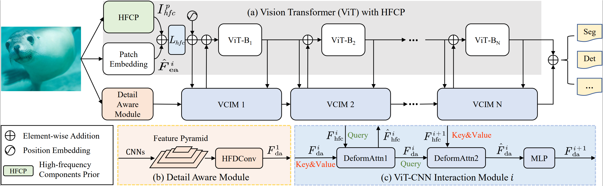

## ViT-UWA

The official implementation of the paper "[ViT-UWA: Vision Transformer Underwater-Adapter for Dense Predictions Beneath the Water Surface](https://ieeexplore.ieee.org/abstract/document/11481591)" .

If you found this project useful, please give us a star ⭐️ or [cite](#citation) us in your paper, this is the greatest support and encouragement for us.

## Updates
🚩 **News** (2026.04) This paper has been accepted as a paper at **IEEE Transactions on Image Processing**.

## Abstract

Vision Transformer (ViT) and its variants have witnessed a significant success in computer vision. However, their performance may degrade in underwater dense prediction tasks due to challenges like complex underwater environments, quality degradation, and light scattering in underwater images. To solve this problem, we propose the  Vision Transformer Underwater-Adapter (ViT-UWA), the first detail-focused and adapted ViT backbone for underwater dense prediction tasks, without requiring task-specific pretraining. In ViT-UWA, we first introduce High-frequency Components Prior (HFCP) to add high-frequency information of underwater images to the plain ViT, which can help recover and capture lost high-frequency information of underwater images. Then, we propose a Detail Aware Module (DAM) to obtain a detail-focused multi-scale convolutional feature pyramid, which can be used in kinds of dense prediction tasks. Through the ViT-DAM Cross Fusion (VDCF), we achieve bidirectional feature cross fusion between ViT and DAM. We evaluate ViT-UWA on multiple underwater dense prediction tasks, including semantic segmentation, instance segmentation, and object detection. With only ImageNet-22K pretraining, our ViT-UWA-B yields state-of-the-art 46.4 box AP and 44.2 mask AP on USIS10K dataset, which demonstrates the superiority of our method. Our code is available at https://github.com/Linqirui/ViT-UWA.

## Method



## Citation

If you find our ViT-UWA useful for your research, please cite us:

```
@article{jia2026vit,
  title={ViT-UWA: Vision Transformer Underwater-Adapter for Dense Predictions Beneath the Water Surface},
  author={Jia, Yuheng and Lin, Qirui and Li, Hua and Li, Yutong and Kwong, Sam and Cong, Runmin},
  journal={IEEE Transactions on Image Processing},
  year={2026},
  publisher={IEEE}
}
```

## Acknowledgement
This repository is implemented based on the [MMDetection](https://github.com/open-mmlab/mmdetection) framework and [MMSegmentation](https://github.com/open-mmlab/mmsegmentation) framework. In addition, we referenced some of the code in the [ViT-Adapter](https://github.com/czczup/ViT-Adapter) repository. Thanks to them for their excellent work.


## License

This repository is released under the Apache 2.0 license as found in the [LICENSE](LICENSE.md) file.
